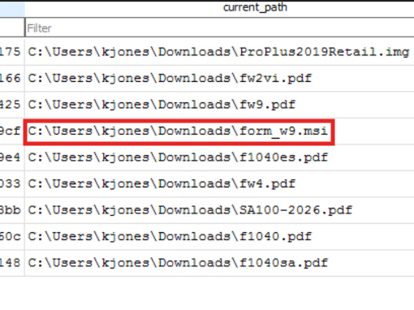

# ESCENARIO
Every year around tax season, accountants are buried in forms, filings, and contractor paperwork. Attackers know this. They count on the urgency, the routine, the muscle memory of downloading one more document. This time it worked.
The machine has been imaged and the evidence is in front of you — start digging.

---
## Initial Access
1. While searching and downloading tax forms, kjones certainly downloaded a file that doesn't fit what he was looking for. What is the name of that file?
	- Nos vamos a Sysmon Event ID 11 y filtramos por C:\Users\kjones\Downloads\; vemos que el fichero que más difiere respecto al resto es el .msi.

	-  También se puede ver en el el archivo History de Chrome, abriéndolo con DB Browser SQLite. Además aquí se ve mejor que no cuadra con el tipo de formato con el que trabaja el usuario afectado.

2. What time was that file downloaded?
   - Nos sirve tanto la hora registrada en el Event ID 11 como la hora registrada en la base de datos History, en la tabla Downloads.

   - Pasado a formato legible: 

3. What domain was that file downloaded from?
	- Aparece en la base de datos History, en la tabla Downloads

4. At some point kjones opened the files he downloaded, which triggered the execution of the rogue file. When exactly did that happen?
	- Para esta pregunta tenemos varias maneras de averiguarlo. Yo he contrastado dos, filtrando siempre por msiexec a partir de la fecha de descarga de la pregunta 2:
	- Por un lado tenemos UserAssist, con el que vemos ejecuciones intencionales por GUI

	- Por otro tenemos Prefetch, con el que vemos que se ejecutó sobre la hora de la descarga y concide con lo que aparece en UserAssist

## Persistence
5. The execution of that file immediately triggered a chain of events leading to the installation of a remote management tool. A new service was registered on the system shortly after. What is the name of that service?
6. The same installation also deployed a second remote access tool. What is the service name registered for this second tool?
	- Estas dos preguntas las respondo a la vez ya que en System.evtx Event ID 7045, podemos ver los servciios instalados:

## Discovery
7. After gaining access, the attacker started discovery activity through the RMM. There is a specific process belonging to the RMM agent that acted as the parent to all subsequent attacker commands on the system. What is the name of that process?
	- Aquí he tirado de IA para que me explicase qué procesos suele spawnear AlteraAgent con los que se inician comandos en el sistema: se suele usar AgentPackageRunCommandInteractive.exe.
	- En Sysmon, buscamos por Event ID 1 y filtramos por ese nombre para comprobar:

8. The attacker queried registry keys to check the current state of the system before making any changes. What was the first registry key they queried?
	- Vamos a filtrar en Sysmon Event ID 1 por reg  query. 
	- El atacante hace dos reg query pero solo nos piden la primera. 
	- Siempre fijandonos en el timeline que llevamos para saber que tenemos que mirar a partir de las 18:14 para saber que tiene que ver con el ataque. Todo lo anterior no nos vale de nada.

## Credential Access
9. The attacker then attempted to dump LSASS to steal credentials but was immediately blocked by Defender. When did Defender first detect this attempt?
	- Nos vamos a Microsoft-Windows-Windows Defender%254Operational.evtx, filtramos por lsass y vemos que hay varios intentos de dumpeos de lsass. Cogemos el primero que es el que nos piden.

## Stealth & Defense Impairment
10. Failing to dump LSASS, the attacker tried to stop Defender directly but was also blocked. What exact command did the attacker run to attempt this?
	- Seguimos en Microsoft-Windows-Windows Defender%254Operational.evtx y ordenamos por tipo de alerta. Vamos revisándolas una a una hasta encontrar el comando especificado:

11. With both attempts blocked, the attacker launched an interactive PowerShell session and dropped two files into the system. What are the names of those two files?
	- Nos vamos a Sysmon Event ID 11 filtrando por Powershell y vemos los dos archivos creados. 
	- HWAuidoOs2Ec.sys es un driver legítimo y firmado pero que el atacante ha explotado porque sabe que tiene una vulnerabilidad. De ahí el enunciado del laboratorio (BYOVD - Bring Your Own Vulnerable Driver)

12. The attacker then registered one of those dropped files as a kernel service. What name did the attacker give to that service?
	- Volvemos a System.evtx y filtramos por el Event ID 7045. Vemos el ultimo servicio creado.

13. One of the two dropped files was an executable designed to kill Windows Defender. When was it executed for the first time?
	- Vamos en busca del Prefetch de kd.exe para ver sus últimas ejecuciones y quedarnos con la primera ejecución

14. Load that executable in IDA. What is the process name this executable targets?
	- Cargamos el malware en IDA y nos vamos a View → Open Subviews → Strings. Me imaginaba que iba a ser MsMpEng.exe ya que es el proceso del motor de Microsoft Defender pero lo corroboro:

15. Continue your analysis in IDA. The executable communicates with the loaded driver by sending it a specific control code. What is the IOCTL code passed to DeviceIoControl?
	- No tengo mucha experiencia con análisis de malware por lo que buscando por Internet, saqué la respuesta: 0x2248DC

## Credential Access
1. With Defender neutralized, the attacker successfully dumped LSASS. When was the dump file created on disk?
	- Miramos de nuevo en Sysmon Event ID 11 y filtramos por lsass
	- Siempre me ajusto a la pregunta y al timeline del suceso. No tengo que investigar mucho más porque en este caso voy llevando las horas del ataque y puedo llevar el timeline
